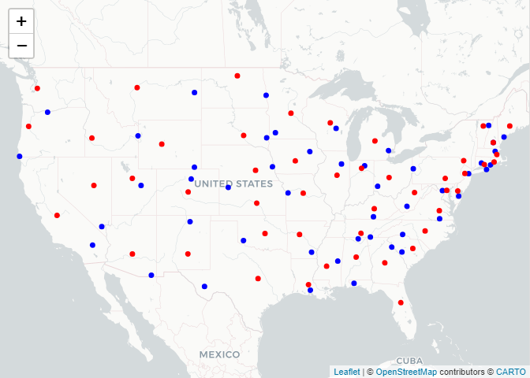
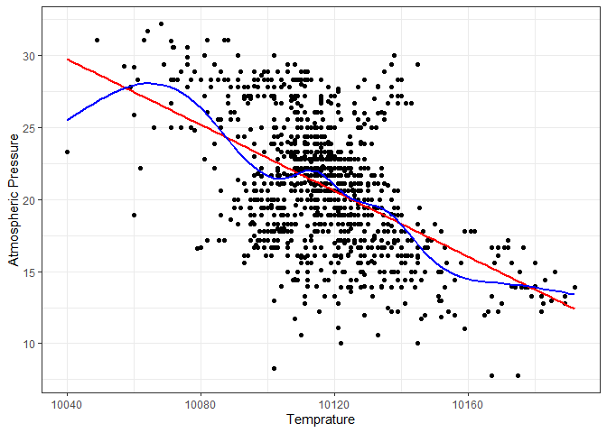
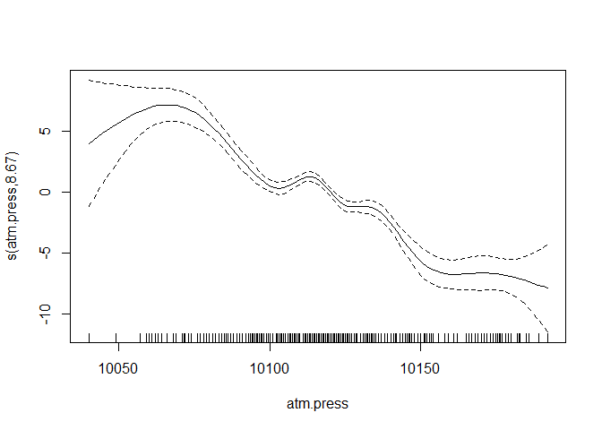

Lab 05 - Data Wrangling
================

# Learning goals

- Use the `merge()` function to join two datasets.
- Deal with missings and impute data.
- Identify relevant observations using `quantile()`.
- Practice your GitHub skills.

# Lab description

For this lab we will be dealing with the meteorological dataset `met`.
In this case, we will use `data.table` to answer some questions
regarding the `met` dataset, while at the same time practice your
Git+GitHub skills for this project.

This markdown document should be rendered using `github_document`
document.

# Part 1: Setup a Git project and the GitHub repository

1.  Go to wherever you are planning to store the data on your computer,
    and create a folder for this project

2.  In that folder, save [this
    template](https://github.com/JSC370/JSC370-2024/blob/main/labs/lab05/lab05-wrangling-gam.Rmd)
    as “README.Rmd”. This will be the markdown file where all the magic
    will happen.

3.  Go to your GitHub account and create a new repository of the same
    name that your local folder has, e.g., “JSC370-labs”.

4.  Initialize the Git project, add the “README.Rmd” file, and make your
    first commit.

5.  Add the repo you just created on GitHub.com to the list of remotes,
    and push your commit to origin while setting the upstream.

Most of the steps can be done using command line:

``` sh
# Step 1
cd ~/Documents
mkdir JSC370-labs
cd JSC370-labs

# Step 2
wget https://raw.githubusercontent.com/JSC370/JSC370-2024/main/labs/lab05/lab05-wrangling-gam.Rmd
mv lab05-wrangling-gam.Rmd README.Rmd
# if wget is not available,
curl https://raw.githubusercontent.com/JSC370/JSC370-2024/main/labs/lab05/lab05-wrangling-gam.Rmd --output README.Rmd

# Step 3
# Happens on github

# Step 4
git init
git add README.Rmd
git commit -m "First commit"

# Step 5
git remote add origin git@github.com:[username]/JSC370-labs
git push -u origin master
```

You can also complete the steps in R (replace with your paths/username
when needed)

``` r
# Step 1
setwd("~/Documents")
dir.create("JSC370-labs")
setwd("JSC370-labs")

# Step 2
download.file(
  "https://raw.githubusercontent.com/JSC370/JSC370-2024/main/labs/lab05/lab05-wrangling-gam.Rmd",
  destfile = "README.Rmd"
  )

# Step 3: Happens on Github

# Step 4
system("git init && git add README.Rmd")
system('git commit -m "First commit"')

# Step 5
system("git remote add origin git@github.com:[username]/JSC370-labs")
system("git push -u origin master")
```

Once you are done setting up the project, you can now start working with
the MET data.

## Setup in R

1.  Load the `data.table` (and the `dtplyr` and `dplyr` packages),
    `mgcv`, `ggplot2`, `leaflet`, `kableExtra`.

``` r
library(data.table)
library(dtplyr)
library(dplyr)
```

    ## 
    ## Attaching package: 'dplyr'

    ## The following objects are masked from 'package:data.table':
    ## 
    ##     between, first, last

    ## The following objects are masked from 'package:stats':
    ## 
    ##     filter, lag

    ## The following objects are masked from 'package:base':
    ## 
    ##     intersect, setdiff, setequal, union

``` r
library(mgcv)
```

    ## Loading required package: nlme

    ## 
    ## Attaching package: 'nlme'

    ## The following object is masked from 'package:dplyr':
    ## 
    ##     collapse

    ## This is mgcv 1.9-0. For overview type 'help("mgcv-package")'.

``` r
library(ggplot2)
library(leaflet)
library(kableExtra)
```

    ## 
    ## Attaching package: 'kableExtra'

    ## The following object is masked from 'package:dplyr':
    ## 
    ##     group_rows

``` r
fn <- "https://raw.githubusercontent.com/JSC370/JSC370-2024/main/data/met_all_2023.gz"
if (!file.exists("met_all_2023.gz"))
  download.file(fn, destfile = "met_all_2023.gz")
met <- data.table::fread("met_all_2023.gz")
```

2.  Load the met data from
    <https://github.com/JSC370/JSC370-2024/main/data/met_all_2023.gz> or
    (Use
    <https://raw.githubusercontent.com/JSC370/JSC370-2024/main/data/met_all_2023.gz>
    to download programmatically), and also the station data. For the
    latter, you can use the code we used during lecture to pre-process
    the stations data:

``` r
# Download the data
stations <- fread("ftp://ftp.ncdc.noaa.gov/pub/data/noaa/isd-history.csv")
stations[, USAF := as.integer(USAF)]
```

    ## Warning in eval(jsub, SDenv, parent.frame()): NAs introduced by coercion

``` r
# Dealing with NAs and 999999
stations[, USAF   := fifelse(USAF == 999999, NA_integer_, USAF)]
stations[, CTRY   := fifelse(CTRY == "", NA_character_, CTRY)]
stations[, STATE  := fifelse(STATE == "", NA_character_, STATE)]

# Selecting the three relevant columns, and keeping unique records
stations <- unique(stations[, list(USAF, CTRY, STATE, LAT, LON)])

# Dropping NAs
stations <- stations[!is.na(USAF)]

# Removing duplicates
stations[, n := 1:.N, by = .(USAF)]
stations <- stations[n == 1,][, n := NULL]

# Read in the met data and fix lat, lon, temp
met <- data.table::fread("met_all_2023.gz")
met$lat <- met$lat/1000
met$lon <- met$lon/1000
met$temp <- met$temp/10
```

3.  Merge the data as we did during the lecture. Use the `merge()` code
    and you can also try the tidy way with `left_join()`

``` r
met_merged <- merge(
  x = met,
  y = stations,
  by.x = "USAFID",
  by.y = "USAF",
  all.x = TRUE,
  all.y = FALSE
)
```

## Question 1: Identifying Representative Stations

Across all weather stations, which stations have the median values of
temperature, wind speed, and atmospheric pressure? Using the
`quantile()` function, identify these three stations. Do they coincide?

``` r
median_temp_station <- met_merged[
  with(met_merged, which.min(temp != quantile(temp, .5, type = 1, na.rm=TRUE)))
]

median_wind.sp_station <- met_merged[
  with(met_merged, which.min(wind.sp != quantile(wind.sp, .5, type = 1, na.rm=TRUE)))
]
  
median_atm.press_station <- met_merged[
  with(met_merged, which.min(atm.press != quantile(atm.press, .5, type = 1, na.rm=TRUE)))
]

median_temp_station$USAFID
```

    ## [1] 690150

``` r
median_wind.sp_station$USAFID
```

    ## [1] 690150

``` r
median_atm.press_station$USAFID
```

    ## [1] 690150

Station 690150 has the median temp, wind.sp, and atm.press.

Next identify the stations have these median values.

``` r
median_temp <- quantile(met_merged$temp, 0.5, na.rm=TRUE)
median_wind.sp <- quantile(met_merged$wind.sp, 0.5, na.rm=TRUE)
median_atm.press <- quantile(met_merged$atm.press, 0.5, na.rm=TRUE)

median_temp == median_temp_station$temp
```

    ##  50% 
    ## TRUE

``` r
median_wind.sp == median_wind.sp_station$wind.sp
```

    ##  50% 
    ## TRUE

``` r
median_atm.press == median_atm.press_station$atm.press
```

    ##  50% 
    ## TRUE

Knit the document, commit your changes, and save it on GitHub. Don’t
forget to add `README.md` to the tree, the first time you render it.

## Question 2: Identifying Representative Stations per State

Now let’s find the weather stations by state with closest temperature
and wind speed based on the euclidean distance from these medians.

``` r
closest_temp_wind <- met_merged %>%
  mutate(dist_to_med = sqrt((temp-median_temp)^2+(wind.sp-median_wind.sp)^2)) %>%
  select(USAFID, STATE, dist_to_med, lat, lon) %>%
  group_by(STATE) %>%
  slice_min(order_by=dist_to_med, n=1, with_ties=FALSE)
closest_temp_wind
```

    ## # A tibble: 48 × 5
    ## # Groups:   STATE [48]
    ##    USAFID STATE dist_to_med   lat    lon
    ##     <int> <chr>       <dbl> <dbl>  <dbl>
    ##  1 720307 AL              0  34.9  -86.6
    ##  2 720175 AR              0  33.6  -91.8
    ##  3 722720 AZ              0  31.5 -110. 
    ##  4 690150 CA              0  34.3 -116. 
    ##  5 720538 CO              0  40.2 -105. 
    ##  6 725027 CT              0  41.5  -72.8
    ##  7 724093 DE              0  38.7  -75.4
    ##  8 720383 FL              0  30.7  -87.0
    ##  9 720263 GA              0  34.1  -82.8
    ## 10 720293 IA              0  42.5  -91.9
    ## # ℹ 38 more rows

Knit the doc and save it on GitHub.

## Question 3: In the Geographic Center?

For each state, identify which station is closest to the geographic
mid-point (median) of the state. Combining these with the stations you
identified in the previous question, use `leaflet()` to visualize all
~100 points in the same figure, applying different colors for the
geographic median and the temperature and wind speed median.

``` r
geo_medians <- met_merged %>%
  group_by(STATE) %>%
  summarise(med_lat = median(LAT, na.rm=TRUE), med_lon=median(LON, na.rm=TRUE))

closest_geo <- merge(x=met_merged, y=geo_medians, 
                     by.x = "STATE", by.y = "STATE", all=TRUE)

closest_geo <- closest_geo %>%
  mutate(dist_to_med = sqrt((lat-med_lat)^2+(lon-med_lon)^2)) %>%
  select(USAFID, STATE, dist_to_med, lat, lon) %>%
  group_by(STATE) %>%
  slice_min(order_by=dist_to_med, n=1, with_ties=FALSE)

leaflet() %>%
  addProviderTiles('CartoDB.Positron') %>%
  addCircles(data=closest_temp_wind,
             lat= ~lat, lng= ~lon, popup = "Closest Station to Median Temp and Wind Speed",
             opacity = 1, radius = 400, color = "blue") %>%
  addCircles(data=closest_geo,
             lat = ~lat, lng = ~lon, popup = "Closest Station to Geographic Mid Point",
             opacity = 1, radius = 400, color = "red")
```

    ## PhantomJS not found. You can install it with webshot::install_phantomjs(). If it is installed, please make sure the phantomjs executable can be found via the PATH variable.

<!-- -->

Knit the doc and save it on GitHub.

## Question 4: Summary Table with `kableExtra`

Generate a summary table using `kable` where the rows are each state and
the columns represent average temperature broken down by low, median,
and high elevation stations.

Use the following breakdown for elevation:

- Low: elev \< 93
- Mid: elev \>= 93 and elev \< 401
- High: elev \>= 401

``` r
low <- met_merged[(elev < 93), .(low_temp_avg=mean(temp, na.rm=TRUE)), by=STATE]
mid <- met_merged[(elev >= 93 & elev < 401), .(mid_temp_avg=mean(temp, na.rm=TRUE)), by=STATE]
high <- met_merged[(elev >= 401), .(high_temp_avg=mean(temp, na.rm=TRUE)), by=STATE]
merge(merge(low, mid, all=TRUE), high, all=TRUE)[order(STATE)] %>%
  kable()
```

| STATE | low_temp_avg | mid_temp_avg | high_temp_avg |
|:------|-------------:|-------------:|--------------:|
| AL    |     25.07106 |     23.79775 |            NA |
| AR    |     25.58698 |     24.40578 |     23.723926 |
| AZ    |     29.28585 |     30.38057 |     23.892609 |
| CA    |     18.25508 |     18.77071 |     18.148808 |
| CO    |           NA |           NA |     15.184075 |
| CT    |     19.37249 |     18.78433 |            NA |
| DE    |     21.40611 |           NA |            NA |
| FL    |     26.61484 |           NA |            NA |
| GA    |     24.80529 |     23.23841 |            NA |
| IA    |           NA |     22.26228 |     21.992787 |
| ID    |           NA |           NA |     16.415667 |
| IL    |           NA |     22.11707 |     20.843173 |
| IN    |           NA |     20.12731 |            NA |
| KS    |           NA |     24.16196 |     22.098776 |
| KY    |           NA |     21.36103 |     20.178196 |
| LA    |     27.61819 |     26.09414 |            NA |
| MA    |     17.44477 |     17.59058 |            NA |
| MD    |     21.25462 |     20.62255 |     20.648332 |
| ME    |     15.23159 |     15.43930 |     15.329681 |
| MI    |           NA |     18.54432 |     17.977982 |
| MN    |     22.66275 |     21.15523 |     19.931963 |
| MO    |     25.79654 |     23.77652 |     23.300286 |
| MS    |     26.34285 |     24.66682 |            NA |
| MT    |           NA |           NA |     16.293015 |
| NC    |     22.82945 |     21.21073 |     18.046833 |
| ND    |           NA |     21.79236 |     20.415848 |
| NE    |           NA |     23.48598 |     21.048920 |
| NH    |     17.78844 |     16.77731 |      7.243417 |
| NJ    |     19.96563 |     19.31963 |            NA |
| NM    |           NA |           NA |     22.448418 |
| NV    |           NA |           NA |     20.849170 |
| NY    |     18.75621 |     18.31489 |     15.887585 |
| OH    |           NA |     19.43774 |            NA |
| OK    |           NA |     25.07676 |     24.000040 |
| OR    |     15.20318 |     16.39100 |     16.711553 |
| PA    |     20.34185 |     19.40527 |     17.286934 |
| RI    |     17.88116 |     17.46589 |            NA |
| SC    |     23.68407 |     22.38995 |            NA |
| SD    |           NA |     22.79495 |     20.639922 |
| TN    |     25.81362 |     22.89642 |     19.457179 |
| TX    |     28.74462 |     28.08021 |     26.500393 |
| UT    |           NA |           NA |     19.754720 |
| VA    |     21.34826 |     20.49998 |     17.954522 |
| VT    |          NaN |     16.89971 |            NA |
| WA    |     15.25193 |     17.80542 |     16.810354 |
| WI    |           NA |     19.56563 |     17.994615 |
| WV    |           NA |     19.31079 |     17.492150 |
| WY    |           NA |           NA |     13.748173 |

Knit the document, commit your changes, and push them to GitHub.

## Question 5: Advanced Regression

Let’s practice running regression models with smooth functions on X. We
need the `mgcv` package and `gam()` function to do this.

- using your data with the median values per station, first create a
  lazy table. Filter out values of atmospheric pressure outside of the
  range 1000 to 1020. Examine the association between temperature (y)
  and atmospheric pressure (x). Create a scatterplot of the two
  variables using ggplot2. Add both a linear regression line and a
  smooth line.

- fit both a linear model and a spline model (use `gam()` with a cubic
  regression spline on wind speed). Summarize and plot the results from
  the models and interpret which model is the best fit and why.

``` r
met_medians <- met_merged[, .(
  atm.press = median(atm.press, na.rm=TRUE),
  temp = median(temp, na.rm=TRUE)
),
by=USAFID]

met_ldt <- lazy_dt(met_medians, immutable=FALSE)
met_ldt <- met_ldt %>% filter(atm.press >= 10000 & atm.press <= 10200)  %>%
  as.data.table()

met_ldt %>% 
  ggplot(aes(y=temp, x=atm.press)) + 
  geom_point() + 
  geom_smooth(method="lm", color="red", se=FALSE) +
  geom_smooth(method="gam", color="blue", se=FALSE) + 
  labs(x="Temprature", y="Atmospheric Pressure") +
  theme_bw()
```

<!-- -->

``` r
lm_temp <- lm(temp ~ atm.press, data=met_ldt)
summary(lm_temp)
```

    ## 
    ## Call:
    ## lm(formula = temp ~ atm.press, data = met_ldt)
    ## 
    ## Residuals:
    ##      Min       1Q   Median       3Q      Max 
    ## -14.3696  -2.6173   0.1844   2.3012  11.6394 
    ## 
    ## Coefficients:
    ##               Estimate Std. Error t value Pr(>|t|)    
    ## (Intercept)  1.176e+03  5.853e+01   20.09   <2e-16 ***
    ## atm.press   -1.142e-01  5.785e-03  -19.73   <2e-16 ***
    ## ---
    ## Signif. codes:  0 '***' 0.001 '**' 0.01 '*' 0.05 '.' 0.1 ' ' 1
    ## 
    ## Residual standard error: 3.762 on 1083 degrees of freedom
    ## Multiple R-squared:  0.2645, Adjusted R-squared:  0.2638 
    ## F-statistic: 389.4 on 1 and 1083 DF,  p-value: < 2.2e-16

``` r
gam_temp <- gam(temp~s(atm.press, bs='cr'), data=met_ldt)
summary(gam_temp)
```

    ## 
    ## Family: gaussian 
    ## Link function: identity 
    ## 
    ## Formula:
    ## temp ~ s(atm.press, bs = "cr")
    ## 
    ## Parametric coefficients:
    ##             Estimate Std. Error t value Pr(>|t|)    
    ## (Intercept)  20.9378     0.1117   187.5   <2e-16 ***
    ## ---
    ## Signif. codes:  0 '***' 0.001 '**' 0.01 '*' 0.05 '.' 0.1 ' ' 1
    ## 
    ## Approximate significance of smooth terms:
    ##               edf Ref.df     F p-value    
    ## s(atm.press) 8.67  8.968 51.52  <2e-16 ***
    ## ---
    ## Signif. codes:  0 '***' 0.001 '**' 0.01 '*' 0.05 '.' 0.1 ' ' 1
    ## 
    ## R-sq.(adj) =  0.297   Deviance explained = 30.2%
    ## GCV = 13.647  Scale est. = 13.526    n = 1085

``` r
plot(gam_temp)
```

<!-- --> The GAM model
appears to be slightly better fit. The adjusted r-squared of the GAM is
0.297 and the deviance explained is 30.2% versus the linear regression
model which has an adjusted r-squared of 0.2638 which is moderately
worse.

## Deliverables

- .Rmd file (this file)

- link to the .md file (with all outputs) in your GitHub repository
